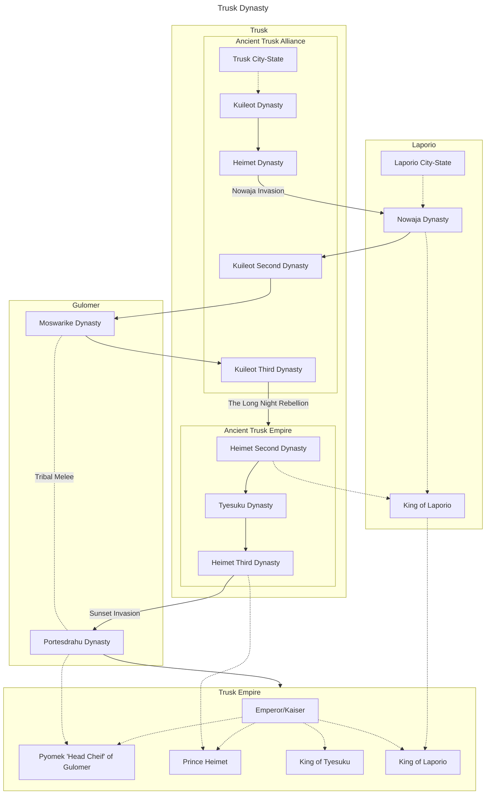

## Intro

Trusk is a kingdom that lies at the crossroads between the eastern and western continents, located in the northeastern part of planet Laaerad. It has always played an important role throughout history.

The word “Trusk” originates from the official language of the Trusk nation. Its etymology can be traced back to the ancestral tongue of the Laaerad peoples, specifically to the word “tʰro,” which means “to make.” This name may have been adopted due to Trusk's relatively advanced manufacturing capabilities at the time, reflecting a culture strongly associated with craftsmanship and production.

## Geography 

The vast area called Trusk has high mountains in the west, humid jungles in the south, and large swamps and jungles in the northeast as its natural borders. The territories once owned by the Empire are also not limited to this, and the Imperial Fleet once established many bases in Long Island, the southernmost tip of the East Continent.

#### Terrain: Trusk Basin, Nowaja Sea, and grasslands along the Gulomer River

The terrain of Trusk is mainly coastal plains. There is a large basin in the western origin of Trusk, also known as the Trusk Basin. The corridor between the two oceans in the east connects to the Gulomer territory in the north and the large jungle on the border of Yiying in the south. The Laporio Strait is on the other side of the Novaya Sea. There are two large lakes on the west side of the Laporio territory, and on the east side there are river deltas formed by the erosion of several rivers flowing into the sea.

#### Climate: Novaya Sea with different periods of rain and heat

The core area of ​​Trusk is dominated by a Mediterranean climate with different periods of rain and heat, but the north is also affected by the ocean currents from the North Sea and has a temperate monsoon climate. A large part of the southern Laporio region is in the subtropics, with many jungles and broad-leaved forests. There are large sparsely wooded plains between the southernmost part and Long Island, which are difficult to cross. There are a large number of virgin forests and humid plateaus in the southeast.

#### Vegetation

The Mediterranean climate zone has a rich variety of plant types. The jungles and deserts in the southwest and southeast have their own corresponding vegetation.

## Animals

Complex animal communities caused by various climate types. Meat livestock (poultry) mainly include chickens, ducks, sheep, and pigs, and transport livestock include cattle, horses, and donkeys

The Novaya Sea had rich fishery resources in the early days. There are many types and quantities of fish.

There is a near-river community ecology along the river in the Trusk Basin.

### **The Trusk Empire**

The **Trusk Empire** is composed of three major kingdoms:

1. **The Kingdom of Gulomer**, also known as the **Northern Realm**, is primarily made up of the territories of the **Gulomer clans**, a nomadic people of the north.
    
2. **The Kingdom of Trusk**, the imperial heartland, is also referred to as the **Kingdom of Heimet**. In the early days of the empire, it was further divided into two realms: **Heimet** and **Tyesuku**.
    
3. **The Kingdom of Laporio**, also called the **Kingdom of Nowaja**, derives its alternative name from the ancient Laporio word _“Nowaja”_, meaning _“by the sea”_.

## Origins

### Trusk: Homeland of Kings

> Today, everyone within the bounds of the Trusk Empire identifies as a Trusk. Drawing from chronicles, legends, and other sources, it is widely believed that the tribe known as the <ruby>Trusk<rt>图斯克</rt></ruby> first originated from a settlement nestled in the mountains west of the Strait. It is said they were called <ruby>tʰroko<rt>特洛扣</rt></ruby>—“makers” or “craftsmen”—by neighboring tribes, due to their superior skill in crafting. This word is thought to have gradually evolved into “Trusk” in the Trusk language. *—Latroda Kuileot, Trusk: A People, A Nation, A Dream*

The Trusk were once an unremarkable tribe in the western highlands of what is now the Empire. After the Bronze Age, they rose swiftly, annexing neighboring tribes and eventually establishing a full-fledged city-state. The prevailing theory attributes their rise to the discovery of a large iron deposit nearby, which gave them an early technological advantage in metallurgy.

### Laporio: Barbarians or Partners?

The Laporian people were a collective of ethnic groups centered around two city-states near the Strait of Laporio. Their history with the Trusk People is one of frequent and intense conflict. Most of the time, Laporio was subject to Trusk political dominance—though not always.

> Modern Trusks often retrospectively include the Laporian Dynasty as one of their own, referring to it as the Nowaja Dynasty. However, we as scholars must acknowledge objectively that it was, in truth, the most decisive victory Laporio ever achieved over Trusk. The cultural, linguistic, and social influence of the Laporio during this period deeply impacted the development of Trusk civilization. *—Lajoda Kuileot, A Brief History of Trusk*

---

## The Age of City-States: Origins of Kingship

### The First King: <ruby>Kuileot<rt>奎列奥</rt></ruby>

Today, _Kuileot_ survives as a family name in the Trusk language. The origins of the name of the legendary King Kuileot are debated. One hypothesis posits that the name derived from a local deity once worshipped in a conquered city-state, whose name gradually came to denote the ruling family during the process of unification. Another theory suggests that in ancient Trusk, _Kuileot_ meant “gold” and referred to traveling merchants—many of whom dealt in gold and eventually gained political influence during the wars of unification. A third interpretation posits that the term was originally a royal epithet, indicating “the one who holds the most gold.”

King Kuileot is the first monarch for whom there exists surviving historical record. Before him, it seems the Trusk had no tradition of recording history—or perhaps prior inscriptions were lost. Inscriptions describe him as a gatherer of wealth, a lawgiver, and a builder of palaces. They also reference the war against the Heimet, though the details are sparse—only that his wealth was “nearly exhausted,” suggesting a brutal campaign. After Kuileot conquered the Heimet and united the city-states between Trusk and the two rivers near the Strait, he established the Kuileot Dynasty.

Interestingly, his immediate successors bore names unrelated to his, such as “Leukkiap” (literally, “the one who grills meat”). But from the fourth monarch onward, all kings bore _Kuileot_ in their titles—thus the era came to be known as the Kuileot Dynasty, even if _Kuileot_ was originally a title rather than a name.

The dynasty lasted approximately 800 years. During this period, agriculture remained relatively primitive, and while some economic accumulation occurred, it was insufficient to support long-term centralized rule. Border raids by tribal groups, unstable food supplies, and the lack of a formal succession system made governance fragile. Inscriptions suggest no clear pattern of inheritance, nor whether rulers were blood-related or succeeded by other means, such as merit or internal selection.

---

## The Wrath of Gods: The Heimet Dynasty

As with many dynasties, the Kuileot line ended during a cycle of political instability and agricultural collapse. Late Kuileot inscriptions mention a prolonged drought and question the king's legitimacy, though specific details remain unclear. During this time, several border city-states in northern Laporio took advantage of the chaos and invaded the southern Trusk Basin.

While the Kuileot army was preoccupied with defending the south, the lord of Heimet, <ruby>Mataasioksaamen<rt>马塔肖萨门</rt></ruby>, raised an army in the name of the Sea Gods. The Heimet forces swiftly captured half of Trusk's core cities, including the capital, and took the young Kuileot king prisoner. They also severed supply lines to the Kuileot military, which soon collapsed from famine.

After stabilizing internal rule, the Heimet army launched a successful counterattack and repelled the Laporian invaders, even seizing several of their cities. However, Heimet's hold over Trusk was challenged by several factions: remnants of the Kuileot aristocracy, displaced nobles seeking power, and older clans once oppressed under Kuileot rule. Civil unrest persisted for years.

During this transitional period, Mataasioksaamen consolidated his rule and enacted reforms:

- The _Trusk-Heimet Pantheon_ was established by reorganizing and elevating the Sea God in the religious hierarchy;
    
- New taxation policies targeted traveling merchants;
    
- Legal reforms were attempted, though not codified;
    
- Major infrastructure projects, such as the _Mataasioksaamen Road_, were built to connect Heimet with Trusk Basin, with new ports along the southern coast.
    

These reforms, later known as the Mataasioksaamen Reforms, laid the groundwork for Trusk's eventual maritime expansion.

Mataasioksaamen himself never claimed kingship. Instead, his son married a Kuileot princess and ascended the throne—thus beginning the **Heimet Dynasty**.

This dynasty enhanced agricultural productivity, enabling the state to better feed its growing population. Commerce flourished thanks to the new infrastructure, and the first monetary system began to take shape. While the new laws protected commoners' rights, they also solidified aristocratic privilege, setting the stage for future political conflicts.

**Barbarian Invasions: The Nowaja Dynasty and the Second Kuileot Dynasty**

In the early city-state period, the **Laporio** people of the south did not develop into a structured nation-state. The southern lands, excessively hot and humid, were unsuitable for farming, and the Laporio population struggled to achieve significant growth. However, after the **Heimet** Empire counterattacked and nearly destroyed several northern states that spoke Laporio dialects, the Laporio people began to recognize the importance of unity.

During the centuries of Heimet rule in the north, the Laporio people gradually formed a loose alliance of city-states under the leadership of the wealthiest city-state west of the Laporio Strait to resist the increasing oppression from the Trusk. There was a period of relative peace between the two alliances: Trusk and Laporio coexisted peacefully along their borders, merchants traveled freely between them, ships sailed unimpeded across the **Nowaja Sea**, and caravans with official permits moved seamlessly across frontiers. After acquiring high-quality iron ore and tools from the Tyesuku, Laporio agricultural technology advanced rapidly, and farmland expanded swiftly. According to unearthed inscriptions, a brief ice age during the mid-Heimet period likely crippled agricultural production in the northern Heimet territories. The Laporio, benefiting from the south’s humid climate, maintained stable food output and likely exported large quantities of grain to the Tyesuku. This trade surplus may have been key to the Laporio eventually surpassing the Tyesuku in overall national strength.

By this time, the Tyesuku had grown dangerously reliant on Laporio grain imports. The Tyesuku king long harbored concerns about this dependency, and the Heimet Empire spent decades negotiating with the Laporio. However, during this period, a sudden surge in the use of "Referencing Space"—a high-phase anomaly linked to "magic"—caused widespread destruction and public panic.

The **Nowaja War** erupted in the late Heimet period, lasting roughly twenty years. For the first seventeen years, conflicts were limited to minor skirmishes between border nobles, while intense battles occurred primarily in the final three years. The war was largely unremarkable, as both armies became mired in endless logistical chaos. The Nowaja forces lacked efficient transportation and supply systems, while the Heimet army fundamentally lacked adequate food provisions.

The **Nowaja Dynasty** ultimately conquered Heimet by controlling its food supply, leaving the fractured northern territories unable to mount effective resistance. Details of Nowaja governance remain scarce—perhaps because the dynasty did not record history through inscriptions, or because the later Second **Kuileot** Dynasty politically purged such records. From **Kuileot**-era texts, we know the Nowaja rulers pursued a policy of non-intervention, focusing on regulating grain distribution and labor rather than major reforms. The aristocratic culture inherited from Heimet weakened, as the Nowaja elite comprised warlords and merchants rather than a formal nobility. The Nowaja had no true "emperor," though **Kuileot** records borrowed the Tyesuku term to describe their leaders. Likely, the "emperor" was a figurehead elected through power balances, possibly even with fixed terms. His role centered on religious rituals and organizing military campaigns, particularly against the rising **Gulomer** people, who persistently harassed the borders.

The Nowaja Dynasty collapsed when its last "emperor" died on a campaign against the Gulomer. Though his successor stabilized the frontlines, the **Kuileot** faction—a political force long operating in obscurity within the Tyesuku Basin—seized the moment to revolt. Exploiting the Nowaja army's preoccupation with the Gulomer front, **Kuileot**rebels swiftly captured the capital, Heimet. The Nowaja forces negotiated a retreat via sea routes back to **Nowaja City**, marking the rise of the Second **Kuileot** Dynasty. Initially confined to the Tyesuku-Heimet region, the **Kuileot**'s territorial limitations would soon be shattered by the meteoric rise of the Gulomer people.