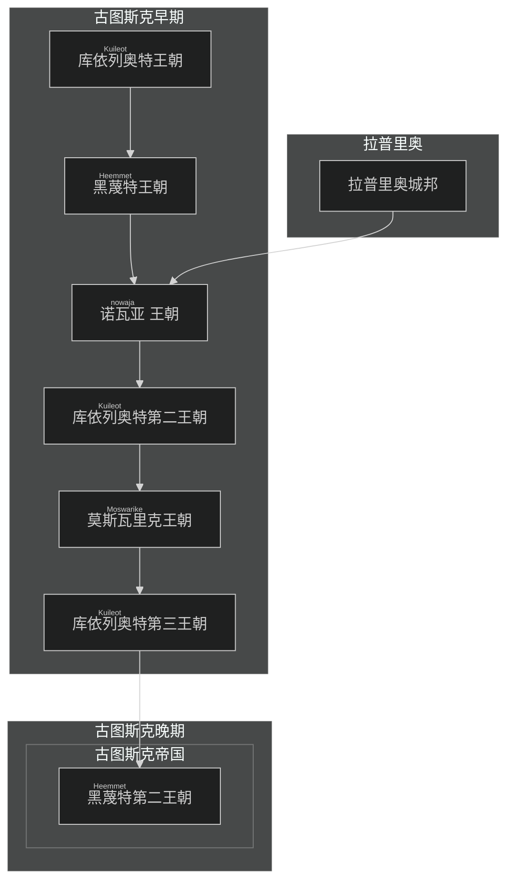

 
(图斯克帝国疆域示意图) ![[laaerad24mainlandv0.1.1 Bitmap Output 4096.png]]
## 简介

图斯克，是近古时期拉埃拉德旧大陆最中央的国家。它是衔接东西方的桥梁，在拉埃拉德东陆北侧，古典到中古时期的历史舞台上始终扮演着举足轻重的角色。

“图斯克”一词，来源于海峡图斯克语中的“Trusk”，而“Trusk”则源于更古老的 [[原始语]] ——“tʰro”。“tʰro”意为“制造”，这一称呼可能源自于早期图斯克人发达的造船业。

### 地理

> 图斯克的疆域，如同它在历史中的地位一般，横跨大海峡两端，辽阔而富饶。广袤的平原上，金色的麦浪随风翻滚，诉说着丰收的喜悦；星罗棋布的湿地，孕育着无数生灵，宛如自然的馈赠。帝国的边界，最终在高耸的山脉前画上了句号，仿佛是巨人守护着这片土地的安宁。

当代称作图斯克的广袤地区，以西部的高山，南部湿热的丛林，东北部的大沼泽和大丛林为自然边界。帝国曾经拥有的领土当然也不拘束与

#### 气候
温和宜人的气候，是图斯克得天独厚的优势。这里四季分明，雨热不同期，如同地球上的地中海气候，为农业和贸易提供了优越的条件。

## 简要历史

- 截止时间：中古晚期

>  如今，但凡是图斯克帝国所及范围之内的人，都将自己称作图斯克人。结合史书、经传、传说等，多方信源考据后，我们可以认为“<ruby>图斯克<rt>Trusk</rt></ruby>”，作为一个部族，最早起源于海峡西侧山脉的某个聚落。他们被称作图斯克，有一种说法是他们制造器物的水平十分高超，被周围的部族称作“<ruby>特洛扣<rt>tʰroko</rt></ruby>”，即做东西的人、工匠之意，而后逐渐讹变成图斯克语的 “Trusk”。
>  *——<ruby>拉卓达<rt>Latroda</rt>·库依列奥特<rt>Kuileot</rt></ruby> 《图斯克：一个民族、一个国家、一个梦想》*

一般认为图斯克，最早是如今帝国西部山脉中的一个不甚起眼的小部落，这个部落在青铜时代后快速发展并且吞并了附近的几个小部落，逐渐发展为成规模的城邦。图斯克这一时期的快速崛起，其具体原因众说纷纭，目前主流的观点认为，图斯克部落附近有一处大型的铁矿，图斯克部落依此，发展出了领先于同时代的各部落的冶炼水平。

进入城邦时代（图斯克称山河纪）后，早期的图斯克城邦四处征战，为帝国的成型打下了坚实的基础。随着农业活动的繁荣、技术的进步以及剩余资源的不断积累，图斯克城邦逐渐扩展到辛那支海（北海）边。在另一个方向上，帝国现如今的内海“<ruby>诺瓦亚<rt>nowaja</rt> </ruby>”逐渐被探明。当时的诺瓦亚海边上散布着许多城邦，在气候相对稳定的城邦时代中期，这些城邦各自进入了快速发展的阶段。图斯克凭借先进的锻造技巧以及对内海航行技术的超前研究，逐渐开始主导这一区域的贸易。随后的年岁里，图斯克先后征服了附近沿海的几个城邦。其中最重要的可能是黑蔑特，也即如今首都所在的海峡的城邦。对这一城邦的征服使得帝国最终完成了对诺瓦亚海和大陆东西交流枢纽的掌握，为帝国最终的兴起奠定了基础。

提到图斯克这一时期的历史，无法绕开的是拉普里奥人。拉普里奥人是拉普里奥海峡附近两个城邦、以及它们辐射范围内族群的统称。图斯克和他们有过长久而激烈的争斗。拉普里奥位于气候更为温暖的南方，在农业技术和人口发展上有着更强大的优势。在与拉普里奥人接触后的图斯克历史中，大多数时间，拉普里奥人都受到图斯克政权的压制。当然也有例外的时候。

> 现如今的图斯克人，往往也将拉普里奥王朝看作一个古代图斯克帝国的王朝（即诺瓦亚王朝）。尽管作为一个图斯克学者，我们仍应当秉着客观的态度说，拉普里奥王朝就是拉普里奥城邦在对图斯克的争斗中，最为彻底的一次胜利。拉普里奥的文化、语言、文字、习俗在这一时期，都不可避免地，对图斯克产生了深远的影响。
> —— *<ruby>拉卓达<rt>Latroda</rt>·库依列奥特<rt>Kuileot</rt></ruby> 《图斯克简史》*

下图是`《图斯克简史》`中提及的古图斯克世系。诺瓦亚王朝是拉普里奥人反抗图斯克人对诺瓦亚海的入侵的一次尝试。尽管仅仅存在了七十余年，历代的图斯克人总是试图忽视或掩盖，这个王朝实际上为拉普里奥人所建立的事实。如今，信仰图斯克民族主义的图斯克人为他们的帝国感到无上的荣光与骄傲，而诺瓦亚王朝似乎成为了图斯克民族主义头顶一朵无法抹去的乌云。颇为有趣的是，同样宰治了图斯克疆域近百年，纯由图斯克人眼中的“蛮族”组成的王朝，莫斯瓦里克，却鲜少作为相同的材料被提起，这或许也由“蛮族”的人口一直相对不多，并且遭到了图斯克文化的高度同化所致。这一时期的图斯克国区域内各政权和城邦，也并不是紧密地团结在蛮族的统治之下。

古图斯克早期最终结束于动荡的库依列奥特第三王朝。黑蔑特家族的再一次背叛终结了黄金家族的统治，黄金家族的末代君王死于乱军之中。黑蔑特家族在整合了首都的部队后向着图斯克帝国各地开始进发。库依列奥特王朝的动荡、灾荒，地方行政系统和军队系统的崩溃使得黑蔑特军队几乎没有遭到太多的抵抗，而和当时咕洛族控制下的蛮族的交锋，也以一场规模不大的战斗后的和谈告终。和谈的内容也相当简单，两国以帝国海峡西侧的大沼泽-大森林一线为界，黑蔑特家族的二王子迎娶蛮族的公主。自此图斯克当代的疆域，逐渐形成雏形。

这一时期黑蔑特家族采取了相对宽容的民族政策，咕洛族群在这一时期开始被整合进帝国。同时，黑蔑特家族试图用宗教统合各个城邦。这一时期也发生了激烈的教派斗争，皇帝亲自下场调节后，图斯克围绕淹神及六大主神的多神教体系被确立起来。政治体质上，开始从以城邦联盟为主的国家向封建制和军区制混合的，多种制度并立的国家形态过渡。黑蔑特家族广泛地分封了在统一战争中有军功的将军和祭司，边境则在当地的族群已有的政治形态中，拔擢亲帝国的势力作为类似总督、土司的角色。

在黑蔑特家族的治理下，帝国的农业生产逐步恢复，手工业相比蛮族入侵前的水平也开始有了增长。这一时期帝国各地的生活水平都在不断提高，这一时期也被称作三帝之治。

### 文明
#### 语言
海峡图斯克语是图斯克语的官方语言。
- 图斯克语拥有诸多方言，图斯克帝国统一后，以首都所在的海峡省份的优势方言为准。首都所在的海峡被称作“<ruby>黑蔑特<rt>Heemmet</rt></ruby>”海峡，是拉埃拉德原始语，意为“太阳所在”，也有学者译作“向阳”。
- 在东北部，一些世代逐水草而居的游牧部落，依然使用着[[咕洛语]]的一种方言。
	- 这种方言很大程度上受到了[[图斯克语]]的影响，但是本质上仍然是[[咕洛语]]

#### 文化
类地中海文明，商业性强，崇尚贵族文化。
- 商业性强：地处拉埃拉德大陆中央交通要冲的图斯克，自古以来就是商贾云集之地。黑姆莫厄特海峡是天然的深水良港，新那支海，诺瓦亚海的船只在这里聚集，来自帝国各地的商品都在这里集散。帝国之外，北境的貂皮、马族的良驹、伊荧的工艺品、阔台的铁器，也纷至沓来。
- 崇尚贵族文化：在图斯克社会，等级观念根深蒂固，贵族阶层拥有至高无上的地位和影响力。由繁茂的商业而催生的各种，礼仪，艺术，以及对知识和文化的追求，深刻地影响着图斯克的文明进程。

