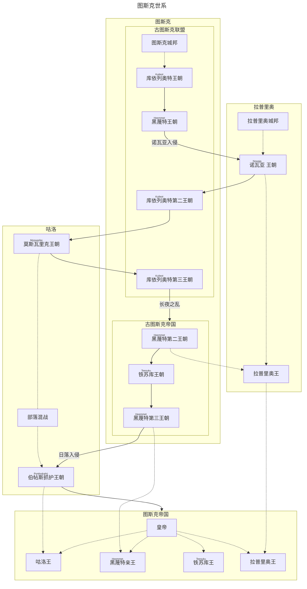

## 简介

图斯克，是近古时期拉埃拉德旧大陆最中央的国家。它是衔接东西方的桥梁，在拉埃拉德东陆北侧，古典到中古时期的历史舞台上始终扮演着举足轻重的角色。

“图斯克”一词，来源于海峡图斯克语中的“Trusk”，而“Trusk”则源于更古老的 [[原始语]] ——“tʰro”。“tʰro”意为“制造”，这一称呼可能源自于早期图斯克人发达的造船业。

### 地理

> 图斯克的疆域，如同它在历史中的地位一般，横跨大海峡两端，辽阔而富饶。广袤的平原上，金色的麦浪随风翻滚，诉说着丰收的喜悦；星罗棋布的湿地，孕育着无数生灵，宛如自然的馈赠。帝国的边界，最终在高耸的山脉前画上了句号，仿佛是巨人守护着这片土地的安宁。

当代称作图斯克的广袤地区，以西部的高山，南部湿热的丛林，东北部的大沼泽和大丛林为自然边界。帝国曾经拥有的领土当然也不拘束于此，帝国舰队曾经深入东陆最南端的长岛建立了许多基地。
![[图斯克疆域图.png]]
#### 气候
图斯克的核心地区以雨热不同期的地中海气候为主，但北部也受到来自北海的洋流影响，有一部分温带季风气候。南部拉普里奥地区有一大部分处于亚热带，多丛林和阔叶林。最南部与长岛之间有大片的稀树平原，难以跨越。东南部则有大量原始森林，以及湿热的高原。

#### 地形
图斯克的地形以沿海平原为主。西部图斯克起源地有一个大盆地，也被称作图斯克盆地。东部两片海洋间的走廊，北接咕洛领地，南接依荧边境的大丛林。拉普里奥海峡在诺瓦亚海的另一侧，拉普里奥领地西侧有两个大湖，东侧则是有几条入海河流冲刷形成的河流三角洲。

#### 植被
地中海气候区有丰富的植物类型。西南和东南的丛林、沙漠则有各自对应的植被。

#### 动物
多种气候类型构成的复杂动物群系。

## 历史

> 图斯克帝国，主要由三个大王国组成，即咕洛王国，也称北陆王国，主要由北方的游牧民族咕洛族各部领地构成；<ruby>图斯克<rt>Trusk</rt></ruby>王国，是帝国的核心领地，也称黑蔑特王国，在帝国早期又被分做黑蔑特和铁苏库两个王国；拉普里奥王国，也称诺瓦亚王国，“诺瓦亚”在古拉普里奥语中是“海边”的意思。

![[三王国图.png]]
### 图斯克起源

#### 图斯克部落

>  如今，但凡是图斯克帝国所及范围之内的人，都将自己称作图斯克人。结合史书、经传、传说等，多方信源考据后，我们可以认为“<ruby>图斯克<rt>Trusk</rt></ruby>”，作为一个部族，最早起源于海峡西侧山脉的某个聚落。他们被称作图斯克，有一种说法是他们制造器物的水平十分高超，被周围的部族称作“<ruby>特洛扣<rt>tʰroko</rt></ruby>”，即做东西的人、工匠之意，而后逐渐讹变成图斯克语的 “Trusk”。
>  *——<ruby>拉卓达<rt>Latroda</rt>·库依列奥特<rt>Kuileot</rt></ruby> 《图斯克：一个民族、一个国家、一个梦想》*

一般认为图斯克，最早是如今帝国西部山脉中的一个不甚起眼的小部落，这个部落在青铜时代后快速发展并且吞并了附近的几个小部落，逐渐发展为成规模的城邦。图斯克这一时期的快速崛起，其具体原因众说纷纭，目前主流的观点认为，图斯克部落附近有一处大型的铁矿，图斯克部落依此，发展出了领先于同时代的各部落的冶炼水平。

#### 图斯克城邦

进入城邦时代（图斯克称山河纪）后，早期的图斯克城邦四处征战，为帝国的成型打下了坚实的基础。随着农业活动的繁荣、技术的进步以及剩余资源的不断积累，图斯克城邦逐渐扩展到<ruby>辛那支<rt>Sinadg</rt></ruby>海（咕洛语“北海”）边。在另一个方向上，帝国现如今的内海“<ruby>诺瓦亚<rt>Nowaja</rt> </ruby>”逐渐被探明。当时的诺瓦亚海边上散布着许多城邦，在气候相对稳定的城邦时代中期，这些城邦各自进入了快速发展的阶段。图斯克凭借先进的锻造技巧以及对内海航行技术的超前研究，逐渐开始主导这一区域的贸易。随后的年岁里，图斯克先后征服了附近沿海的几个城邦。其中最重要的可能是<ruby>黑蔑特<rt>Heemmet</rt></ruby>，也即如今首都所在的海峡的城邦。对这一城邦的征服使得帝国最终完成了对诺瓦亚海和大陆东西交流枢纽的掌握，为帝国最终的兴起奠定了基础。

### 拉普里奥起源

#### 拉普里奥世系

提到图斯克这一时期的历史，无法绕开的是拉普里奥人。拉普里奥人是拉普里奥海峡附近两个城邦、以及它们辐射范围内族群的统称。图斯克和他们有过长久而激烈的争斗。拉普里奥位于气候更为温暖的南方，在农业技术和人口发展上有着更强大的优势。在与拉普里奥人接触后的图斯克历史中，大多数时间，拉普里奥人都受到图斯克政权的压制。当然也有例外的时候。

> 现如今的图斯克人，往往也将拉普里奥王朝看作一个古代图斯克帝国的王朝（即诺瓦亚王朝）。尽管作为一个图斯克学者，我们仍应当秉着客观的态度说，拉普里奥王朝就是拉普里奥城邦在对图斯克的争斗中，最为彻底的一次胜利。拉普里奥的文化、语言、文字、习俗在这一时期，都不可避免地，对图斯克产生了深远的影响。
> —— *<ruby>拉卓达<rt>Latroda</rt>·库依列奥特<rt>Kuileot</rt></ruby> 《图斯克简史》*

### 帝国的雏形：<ruby>黑蔑特<rt>Heemmet</rt></ruby>王朝

古图斯克的城邦时代，最终结束于动荡的库依列奥特第三王朝。黑蔑特家族的再一次背叛终结了黄金家族的统治，黄金家族的末代君王死于乱军之中。<ruby>黑蔑特<rt>Heemmet</rt></ruby>家族在整合了首都的部队后向着图斯克帝国各地开始进发。库依列奥特王朝的动荡、灾荒，地方行政系统和军队系统的崩溃使得<ruby>黑蔑特<rt>Heemmet</rt></ruby>军队几乎没有遭到太多的抵抗，而和当时咕洛族控制下的蛮族的交锋，也以一场规模不大的战斗后的和谈告终。和谈的内容也相当简单，两国以帝国海峡西侧的大沼泽-大森林一线为界，<ruby>黑蔑特<rt>Heemmet</rt></ruby>家族的二王子迎娶蛮族的公主。自此图斯克当代的疆域，逐渐形成雏形。

这一时期<ruby>黑蔑特<rt>Heemmet</rt></ruby>家族采取了相对宽容的民族政策，咕洛族群的一部分在这一时期开始被整合进帝国。同时，<ruby>黑蔑特<rt>Heemmet</rt></ruby>家族试图用宗教统合各个城邦。这一时期也发生了激烈的教派斗争，皇帝亲自下场调节后，图斯克围绕海神及六大主神的多神教体系被确立起来。政治体质上，开始从以城邦联盟为主的国家向封建制和军区制混合的，多种制度并立的国家形态过渡。<ruby>黑蔑特<rt>Heemmet</rt></ruby>家族广泛地分封了在统一战争中有军功的将军和祭司，边境则在当地的族群已有的政治形态中，拔擢亲帝国的势力作为类似总督、土司的角色。这些政策有效地促进了图斯克内部各部族的融合，图斯克以黑蔑特地区和文化为中心的、统一的民族观念被树立起来。

在<ruby>黑蔑特<rt>Heemmet</rt></ruby>家族的治理下，帝国的农业生产逐步恢复，手工业相比蛮族入侵前的水平也开始有了增长。这一时期帝国各地的生活水平都在不断提高，这一时期也被称作三帝之治，大约持续了一百年。

### 励精图治的贤皇：<ruby>铁苏库<rt>Teesuku</rt></ruby>王朝

#### 乱中求治：<ruby>德卓黑<rt>Detshohem</rt></ruby>改革

第三个皇帝没有直系子嗣，政权于是落到了他的外甥，<ruby>铁苏库<rt>Teesuku</rt></ruby>（原始语“暖石”）亲王家的三子<ruby>德卓黑<rt>Detshohem</rt></ruby>手里。他进行了史上著名的<ruby>德卓黑<rt>Detshohem</rt></ruby>改革，将帝国整合为几个大区，任命官员进行管理，将部分的行政管理权收归中央，加强了中央集权，被部分历史学家视作是帝国真正形成的标志。这一时期的帝国国力进一步扩张，但是晚期北方咕洛族和南方拉普里奥族人的叛乱，使得这一时期的帝国显得不那么平静。<ruby>德卓黑<rt>Detshohem</rt></ruby>派出了军队平定了南方，但北方的咕洛人凭借高机动性的骑兵和从括台人处购买的甲胄，对<ruby>德卓黑<rt>Detshohem</rt></ruby>军形成了压倒性的优势，帝国东部的领土被迫压缩到半岛上，咕洛人的兵锋直指首都。<ruby>德卓黑<rt>Detshohem</rt></ruby>在平定南方拉普里奥人的叛乱之后，集中兵力将咕洛人拒之于首都郊外的丘陵<ruby>黑蔑特山<rt>Heemmetsaamen</rt></ruby>间，并与之和谈。和谈的结果是帝国不得不放弃对咕洛人的进一步控制和同化，帝国和咕洛的边境向南推进了两百里，并且帝国必须定期开启互市；咕洛族的大<ruby>丕区袂克<rt>Pyomek</rt></ruby>的女儿嫁给了<ruby>德卓黑<rt>Detshohem</rt></ruby>的弟弟，<ruby>德卓黑<rt>Detshohem</rt></ruby>的大公主<ruby>瓦特苏卡瑟姆<rt>Vatesukasem</rt></ruby>前往咕洛族和亲。

平定东北边患以后，<ruby>德卓黑<rt>Detshohem</rt></ruby>又将帝国的重心放到了南方。在他的少年时期，<ruby>德卓黑<rt>Detshohem</rt></ruby>曾经作为帝国海军的一份子，在帝国拉普里奥以南的地区执勤。在他到达权力巅峰之后，他的心又生出了拓展帝国海疆的愿望。帝国舰队在举国之力的支持下，向着南方进发。帝国的视野被拓展到了长岛，在那里发现了古<ruby>洛斯<rt>Loos</rt></ruby>人的踪迹；帝国舰队也绕过了西南无边无际的大沙漠，发现了沙漠里的方尖碑。神秘的密比恩在这一时期开始进入帝国的视野。

<ruby>德卓黑<rt>Detshohem</rt></ruby>死在了他的六十八岁，此时距离他执掌权柄已经四十余年。他死后，帝国经历了一场不小的权力内斗。他原定的继承人，自己的独子死在了他前头。对于血缘有强烈执着的他，试图迎回自己的大女儿，也即远嫁咕洛的那位大公主<ruby>瓦特苏卡瑟姆<rt>Vatesukasem</rt></ruby>，并扶持她成为皇帝，这一尝试最终以失败告终。贵族和军头们最终扶持了看似平庸的，<ruby>黑蔑特<rt>Heemmet</rt></ruby>·<ruby>法坨<rt>Vatʰom</rt></ruby>一世上位。史称<ruby>黑蔑特<rt>Heemmet</rt></ruby>第三王朝。

#### 日落入侵：<ruby>德卓黑<rt>Detshohem</rt></ruby>的遗产和<ruby>法坨<rt>Vatʰom</rt></ruby>一世的失败

<ruby>黑蔑特<rt>Heemmet</rt></ruby>第三王朝初期，<ruby>法坨<rt>Vatʰom</rt></ruby>一世不断加深对权力的理解后试图强化自己的权力，于是和扶持他上位的那些势力起了冲突；同时<ruby>瓦特苏卡瑟姆<rt>Vatesukasem</rt></ruby>一世也凭借<ruby>德卓黑<rt>Detshohem</rt></ruby>留下的遗产，和夫家咕洛族<ruby>伯帖斯抓护<rt>Portēsdrahū</rt></ruby>家的势力，组织起了属于自己的势力；拉普里奥贵族也在此时再次反叛，组织起了叛军。

三方混战的结果是<ruby>法坨<rt>Vatʰom</rt></ruby>一世的获胜：拉普里奥人没能在战争中取得优势，贵族们被尽数以叛国罪名处以绞刑，成规模的拉普里奥人就此退出历史舞台；<ruby>伯帖斯抓护<rt>Portēsdrahū</rt></ruby>家的战争则很长一段时间内陷入了泥沼。最终<ruby>法坨<rt>Vatʰom</rt></ruby>一世如同前任皇帝<ruby>德卓黑<rt>Detshohem</rt></ruby>一样，在<ruby>黑蔑特<rt>Heemmet</rt></ruby>城郊击溃了来犯，但他也并没有多余的兵力进行反击，最终决定与<ruby>瓦特苏卡瑟姆<rt>Vatesukasem</rt></ruby>一世坐下来进行和谈。

和谈被定在秋日的一个黄昏，一场日落时分的宴会后，只是<ruby>法坨<rt>Vatʰom</rt></ruby>一世并没有机会进行真正的和谈了，<ruby>瓦特苏卡瑟姆<rt>Vatesukasem</rt></ruby>一世安排的刺客在宴会上夺走了<ruby>法坨<rt>Vatʰom</rt></ruby>一世的性命。<ruby>德卓黑<rt>Detshohem</rt></ruby>在宫中四十余年的经营还是没有辜负他的心血，<ruby>瓦特苏卡瑟姆<rt>Vatesukasem</rt></ruby>成功登上皇位，称自己为<ruby>铁苏库<rt>Teesuku</rt></ruby>·<ruby>瓦特苏卡瑟姆<rt>Vatesukasem</rt></ruby>，史称日落女皇。

她即位后拉拢大量咕洛贵族入主图斯克皇庭，咕洛人在<ruby>黑蔑特<rt>Heemmet</rt></ruby>以西的广袤草原跑马圈地，史称日落入侵。

她在位期间没有什么非常突出的贡献，但是这一时期快速促进了咕洛族群和图斯克族群的融合。以<ruby>伯帖斯抓护<rt>Portēsdrahū</rt></ruby>家为首的咕洛贵族和图斯克贵族大量通婚，帝国西部的领土被咕洛后裔大量继承。如前所述，古图斯克的继承制度遗产看显得颇为混乱，而咕洛族的继承规则相较之下更为混乱。当她死后，她的儿子即位，但并没有采用母亲的姓氏，而是称自己为<ruby>伯帖斯抓护<rt>Portēsdrahū</rt></ruby>·<ruby>萨门提姆<rt>Sammentim</rt></ruby>一世。<ruby>伯帖斯抓护<rt>Portēsdrahū</rt></ruby>王朝随之开启了。

### 混乱而自由：<ruby>伯帖斯抓护<rt>Portēsdrahū</rt></ruby>王朝

<ruby>萨门提姆<rt>Sammentim</rt></ruby>一世的统治并不实际由他亲自掌握，他体弱多病，又纵情酒色，即位一年以后就病了，在皇宫深居简出。政权实际上一直掌握在他的父亲，亲王<ruby>伯帖斯寇<rt>Portēsko</rt></ruby>手里。<ruby>伯帖斯寇<rt>Portēsko</rt></ruby>是一名<ruby>灵语者<rt>Johuzay</rt></ruby>，他年轻时对<ruby>灵语<rt>Johuza</rt></ruby>的痴迷影响了他的施政方式，他在施政之前往往需要先求神问卜。但是他的灵语水平实在有限，而真正有水平的灵语者，往往又不屑与参与到朝堂的斗争之中。于是在<ruby>萨门提姆<rt>Sammentim</rt></ruby>一世在位的时间里，帝国的治理可以说是毫无章法。但咕洛贵族们凭借联姻、军队、灵语者，三样坚实的基本盘，牢牢把握着权力。

<ruby>萨门提姆<rt>Sammentim</rt></ruby>一世死后<ruby>伯帖斯抓护<rt>Portēsdrahū</rt></ruby>王朝大约又存在了一百余年，期间在位时间较长的皇帝一共七位，史称<ruby>伯帖斯抓护<rt>Portēsdrahū</rt></ruby>七皇。尽管史书中记载的皇帝有十八位，但七皇外的其余时间里，实际上是门阀、外戚、乃至权势滔天的素人大臣轮流摄政。这一切多被归结于咕洛族始终没有一个明晰的继承规则；且咕洛族入主黑蔑特后逐渐丢失了尚武的传统，皇帝的寿命常常过短；宫廷的制度混乱，<ruby>伯帖斯抓护<rt>Portēsdrahū</rt></ruby>过于热衷联姻，有继承法理的人往往过多。

<ruby>伯帖斯抓护<rt>Portēsdrahū</rt></ruby>王朝里，尽管国家高层陷入了一定程度的混乱，但是宫廷对于地方权力的下放，以及混乱的税法，使得图斯克各地的生产生活又进入了一个快速发展的阶段。铁器的冶炼日渐成熟，农耕技术有了长足的发展；商品经济又恢复到、甚至超过了“三帝之治”时候的水平，图斯克的船从各地的港口出发，前往世界各地。宗教上，失去了以往图斯克皇庭加于各族群的控制以后，各地的各种宗教又逐渐发展起来，海神教失去了一部分主导地位。

#### <ruby>伯帖斯抓护<rt>Portēsdrahū</rt></ruby>王朝的危机

<ruby>伯帖斯抓护<rt>Portēsdrahū</rt></ruby>王朝的宽松政策，固然给受到皇庭压制已久的图斯克各地带来了焕然一新的风气，可也为帝国的又一次崩溃埋下了危机。尽管<ruby>伯帖斯抓护<rt>Portēsdrahū</rt></ruby>皇庭收的税已经相当低，各地贵族还是在想办法进行土地吞并，对各地人民进行进一步的压榨，而宫廷在贵族们的挥霍下，也渐渐无钱可用；<ruby>伯帖斯抓护<rt>Portēsdrahū</rt></ruby>的咕洛族骑兵，在衣食无忧的情况下度过了近百年的岁月，已经逐渐丧失了过去的威风，就连图斯克本土由<ruby>铁苏库<rt>Teesuku</rt></ruby>·<ruby>德卓黑<rt>Detshohem</rt></ruby>设立的皇庭卫队（也称<ruby>铁苏库<rt>Teesuku</rt></ruby>卫队），也因为不受<ruby>伯帖斯抓护<rt>Portēsdrahū</rt></ruby>的信任，逐渐没落了；咕洛族固有的部族斗争在此时也愈演愈烈，在宫廷内部政治斗争的阴云越发浓郁，最终引发了<ruby>伯帖斯抓护<rt>Portēsdrahū</rt></ruby>王朝的危机。

危机开始的标志是<ruby>铁苏库<rt>Teesuku</rt></ruby>家族的又一次起义。<ruby>铁苏库<rt>Teesuku</rt></ruby>家族作为外戚兼异族，在<ruby>萨门提姆<rt>Sammentim</rt></ruby>一世时期，就被<ruby>伯帖斯抓护<rt>Portēsdrahū</rt></ruby>家半流放性质地分封到了图斯克城邦南边的一个城镇，那个地方也随之改名为<ruby>铁苏库<rt>Teesuku</rt></ruby>城。<ruby>铁苏库<rt>Teesuku</rt></ruby>家族的<ruby>德卓黑<rt>Detshohem</rt></ruby>三世苦心经营，吸收拉普里奥山区的藤甲兵作为特种部队，以避开<ruby>伯帖斯抓护<rt>Portēsdrahū</rt></ruby>皇庭的审查。

<ruby>铁苏库<rt>Teesuku</rt></ruby>起义后，帝国各地纷纷响应，咕洛族本地也出现其他部族的叛军，皇庭无兵可用。<ruby>伯帖斯抓护<rt>Portēsdrahū</rt></ruby>王朝倒台，<ruby>铁苏库<rt>Teesuku</rt></ruby>家族作为首先攻破帝国的一方势力，在咕洛部族的妥协下，最终再次登上了皇位。
### 真正的帝国：<ruby>铁苏库<rt>Teesuku</rt></ruby>第二王朝

<ruby>铁苏库<rt>Teesuku</rt></ruby>再一次登上了图斯克的权利顶峰。这一次，皇庭对帝国的行政制度，军事制度，经济制度均进行了一定程度的改革。

首先是帝国的继承制度，<ruby>铁苏库<rt>Teesuku</rt></ruby>·<ruby>德卓黑<rt>Detshohem</rt></ruby>三世明确了第一继承人必须是嫡长子，之后依照庶子、皇兄、皇弟、皇侄、私生子、嫡女的顺序继承、庶女和私生女法理上没有继承权。

靠近首都<ruby>黑蔑特<rt>Heemmet</rt></ruby>的地区，设立<ruby>黑蔑特<rt>Heemmet</rt></ruby>王国进行管辖，军队分为<ruby>黑蔑特<rt>Heemmet</rt></ruby>军和帝国卫队两部分，分别由<ruby>黑蔑特<rt>Heemmet</rt></ruby>亲王和皇帝执掌，<ruby>黑蔑特<rt>Heemmet</rt></ruby>地区的赋税归皇庭直接管辖，<ruby>黑蔑特<rt>Heemmet</rt></ruby>亲王有军权而无实际的领地。<ruby>黑蔑特<rt>Heemmet</rt></ruby>亲王有时候由皇帝亲自兼任，更多时候则由收到信赖的皇子或皇兄担任。<ruby>黑蔑特<rt>Heemmet</rt></ruby>地区下辖的部分，没有分封的领地，而是划分成统一的行政单位进行管辖，官员统一由皇帝进行任免。

<ruby>铁苏库<rt>Teesuku</rt></ruby>原先的领地附近，设置铁苏库王领。<ruby>黑蔑特<rt>Heemmet</rt></ruby>王国以外的区域为<ruby>铁苏库<rt>Teesuku</rt></ruby>王国，为<ruby>铁苏库<rt>Teesuku</rt></ruby>王管辖。第一任的<ruby>铁苏库<rt>Teesuku</rt></ruby>王是<ruby>铁苏库<rt>Teesuku</rt></ruby>·<ruby>德卓黑<rt>Detshohem</rt></ruby>三世的弟弟<ruby>安忽而蔑特<rt>Aanhurmet</rt></ruby>，后来也一直由<ruby>铁苏库<rt>Teesuku</rt></ruby>家族这一支旁系担任。铁苏库王国内采取分封制度，主要分封了在统一战争中有军功的将领和<ruby>铁苏库<rt>Teesuku</rt></ruby>旧臣。

拉普里奥地区则由拉普里奥王管辖，拉普里奥王的法理是早在[[图斯克#帝国的雏形：<ruby>黑蔑特<rt>Heemmet</rt></ruby>王朝|黑蔑特第二王朝]]时期就建立了的，最初的拉普里奥王还是由拉普里奥人担任的，但是在拉普里奥人的多次反叛后，这一爵位已经不总是一个世代相袭的爵位了。王位默认由拉普里奥王的合法继承人继承，但是皇帝在拉普里奥王死亡的情况下可以随意指定继承人来取代原有的继承人。拉普里奥王国内主要也是分封制，但是由于拉普里奥位置的特殊性，南方设立了安南都护府，管理各殖民地，以及与长岛洛斯人、沙漠的密比恩人相关的事务。

咕洛王是图斯克皇庭分封的，咕洛语称皇帝作<ruby>萨劼皮奥马克<rt>Sajepyomak</rt></ruby>（世界的主人，世界的酋长），而在和图斯克合国后出现了<ruby>居皮奥马克<rt>Jupyomak</rt></ruby>（太阳的主人、太阳酋长），统领各<ruby>氏族<rt>Krota</rt></ruby>。各<ruby>氏族<rt>Krota</rt></ruby>依据地理位置的不同有各自的常驻地和管理体系。南方图斯克化比较深的几个<ruby>氏族<rt>Krota</rt></ruby>已经开始形成类图斯克的贵族体系，而北方游牧和渔猎性质较强的<ruby>氏族<rt>Krota</rt></ruby>还保持部落制度。整体的体制和城邦时代的图斯克有些类似，但是游牧部落逐水而居的特性，使得咕洛从来也没有一个稳定的税收制度。所以与其说<ruby>萨劼皮奥蔑克<rt>Sajepyomek</rt></ruby>是一个“王”，“可汗”一样的统领，不如说它是一个称号。

军事制度上，除了首都的军权分立，咕洛族的军事保留原先的部落体制外，每个王国设立常驻兵，黑蔑特地区完全由常驻兵主导，而其他地区还是以封建制的征召兵为主。

经济制度上，经历动荡后的图斯克社会已经失去了统一的货币制度，皇庭在黑蔑特地区重新开始铸币，推行单一的货币税制，同时对商业交易征税；咕洛族地区，则以物料交换的形式收税；其他地区由于连年的动荡局势，货币系统崩溃多年，以实物税为主，主要由领主向各佃农和农奴征收。
## 文明
#### 语言
图斯克语官话以黑蔑特方言为准。黑蔑特方言的特点主要有：开口较大、重音多放在倒数第二音节、以及词尾的降调。
图斯克的方言繁杂，但是主要可以归结为拉普里奥方言和北部方言。拉普里奥方言在图斯克南部被广泛使用，其中融合了大量的古拉普里奥借语；北部方言则主要由咕洛贵族中的图斯克语使用者所主导，有很多咕洛族的语言特点，语音的听感也更加粗犷。

#### 文化
图斯克的文化以海神信仰为核心，加之以黑蔑特家族费心打造的贵族系统。总体而言，图斯克人崇尚自由和冒险精神，但同时也注重家族和荣誉。

地处拉埃拉德大陆中央交通要冲的图斯克，自古以来就是商贾云集之地。黑姆莫厄特海峡是天然的深水良港，新那支海，诺瓦亚海的船只在这里聚集，来自帝国各地的商品都在这里集散。帝国之外，北境的貂皮、马族的良驹、伊荧的工艺品、阔台的铁器，也纷至沓来。由繁茂的商业而催生的各种，礼仪，艺术，以及对知识和文化的追求，深刻地影响着图斯克的文明进程。

同时，在图斯克社会，等级观念根深蒂固，贵族阶层被视作淹神所庇佑的人，反叛领主和皇帝的人会遭到淹神的惩罚。为了国家、领主作战被视为一种荣誉。

图斯克文化中，家庭也被视为十分重要的一环。图斯克社会看重孝道和传承，也相信有其父必有其子的说法，这可能和黑蔑特第二王朝时期短暂实行过的职业户籍制度有关。

### 宗教
#### 海神教
图斯克本土的宗教，是一种以海神信仰为核心的多神教。最早城邦时期的图斯克并不靠海，他们所供奉的神灵应该主要是山神和铸造之神。进入城邦联盟时代，将领土扩展到了黑蔑特海峡，以及诺瓦亚海之后，海神信仰渐渐主导了整个地区的宗教体系。

海神信仰的核心是六个主神：织海神，藏海神，翻海神，涂海神，离海神，长海神。前三个神明又被称作上三神，是造海的三神，对应黑蔑特-图斯克神话中世界的起源：世界原先是一片鸿蒙，第一个觉醒的意识是织海神，祂织造了无边无际的大海；藏海神随之醒来，祂藏起了织海神一半的大海；翻海神把被藏起来的大海“翻”过来，于是世上有了陆地和山林。后三个神明又被称作下三神：涂海神管理浅海、滩涂、沙滩；离海神管理深海和天气；长海神管理河流和陆地。有些地方的记载里，下三神是翻海神的分身，但是更主流的说法是下三神是上三神的共子，是上三神的“影子”。这六神可能和最早加入图斯克城邦联盟的几个城邦各自供奉的神有关，但是其原型现在已经很难清晰地考证了。

进入帝国时代以后，黑蔑特家族试图规范宗教，规定了祭祀方法和各神明的司职。织海神主生育、藏海神主死亡、翻海神主命运、涂海神主战事、离海神主行路、长海神主丰收。有特殊的历法专门记载了祭祀各神明的时节。

六主神之外，也有代表各自然元素的神。如日神、月神、风神等。这些神都归各自的主神管辖，拉普里奥人的神灵也被部分收录进其中。

海神信仰这个核心之外，是淹神信仰。图斯克人相信那些死在海里而又复返的人已经成了神，他们的名号会被记录并列入神册。也因此，图斯克主流的葬礼是海葬，人们会开船到大海中央，向大海撒出骨灰，或是扔出装着尸体的石棺。这种仪式也被称作“藏海”。

