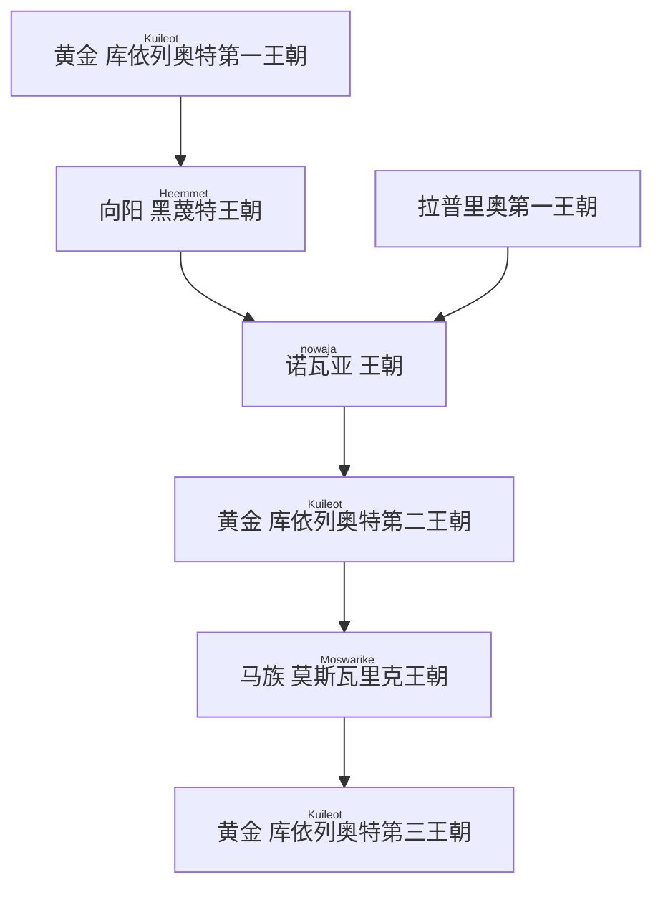

 
(图斯克帝国疆域一览) ![[laaerad24mainlandv0.1.1 Bitmap Output 4096.png]]
## 简介

图斯克，是近古时期拉埃拉德旧大陆最中央的国家。它是衔接东西方的桥梁，在拉埃拉德东陆北侧，古典到中古时期的历史舞台上始终扮演着举足轻重的角色。

“图斯克”一词，来源于海峡图斯克语中的“Trusk”，而“Trusk”则源于更古老的 [[原始语]] ——“tʰro”。“tʰro”意为“制造”，这一称呼可能源自于早期图斯克人发达的造船业。

### 地理
图斯克的疆域，如同它在历史中的地位一般，横跨大海峡两端，辽阔而富饶。广袤的平原上，金色的麦浪随风翻滚，诉说着丰收的喜悦；星罗棋布的湿地，孕育着无数生灵，宛如自然的馈赠。帝国的边界，最终在高耸的山脉前画上了句号，仿佛是巨人守护着这片土地的安宁。
- 自然边界以海峡东部的几座大山，南方的大沼泽，大沙漠，西侧的群山，高原为界。进入南方的

#### 气候
温和宜人的气候，是图斯克得天独厚的优势。这里四季分明，雨热不同期，如同地球上的地中海气候，为农业和贸易提供了优越的条件。

## 简要历史

>  如今，但凡是图斯克帝国所及范围之内的人，都将自己称作图斯克人。结合史书、经传、传说等，多方信源考据后，我们可以认为“<ruby>图斯克<rt>Trusk</rt></ruby>”，作为一个部族，最早起源于海峡西侧山脉的某个聚落。他们被称作图斯克，有一种说法是他们制造器物的水平十分高超，被周围的部族称作“<ruby>特洛扣<rt>tʰroko</rt></ruby>”，即做东西的人、工匠之意，而后逐渐讹变成图斯克语的 “Trusk”。
>  ——<ruby>拉卓达<rt>Latroda</rt>·库依列奥特<rt>Kuileot</rt></ruby> 《图斯克：一个民族、一个国家、一个梦想》

一般认为图斯克，最早是如今帝国西部山脉中的一个不甚起眼的小部落，这个部落在青铜时代后快速发展并且吞并了附近的几个小部落，逐渐发展为成规模的城邦。图斯克这一时期的快速崛起，其具体原因众说纷纭，目前主流的观点认为，图斯克部落附近有一处大型的铁矿，图斯克部落依此，发展出了领先于同时代的各部落的冶炼水平。

进入城邦时代（图斯克称山河纪）后，早期的图斯克城邦四处征战，为帝国的成型打下了坚实的基础。随着农业活动的繁荣、技术的进步以及剩余资源的不断积累，图斯克城邦逐渐扩展到辛那支海（北海）边。在另一个方向上，帝国现如今的内海“<ruby>诺瓦亚<rt>nowaja</rt> </ruby>”逐渐被探明。当时的诺瓦亚海边上散布着许多城邦，在气候相对稳定的城邦时代中期，这些城邦各自进入了快速发展的阶段。图斯克凭借先进的锻造技巧以及对内海航行技术的超前研究，逐渐开始主导这一区域的贸易。随后的年岁里，图斯克先后征服了附近沿海的几个城邦。

提到图斯克这一时期的历史，无法绕开的是拉普里奥人。拉普里奥人是拉普里奥海峡附近两个城邦、以及它们辐射范围内族群的统称。图斯克和他们有过长久而激烈的争斗。拉普里奥位于气候更为温暖的南方，在农业技术和人口发展上有着更强大的优势。在与拉普里奥人接触后的图斯克历史中，大多数时间，拉普里奥人都受到图斯克政权的压制。当然也有例外的时候。

> 现如今的图斯克人，往往也将拉普里奥王朝看作一个古代图斯克帝国的王朝（即诺瓦亚王朝）。尽管作为一个图斯克学者，我们仍应当秉着客观的态度说，拉普里奥王朝就是拉普里奥城邦在对图斯克的争斗中，最为彻底的一次胜利。拉普里奥的文化、语言、文字、习俗在这一时期，都不可避免地，对图斯克产生了深远的影响。
> —— <ruby>拉卓达<rt>Latroda</rt>·库依列奥特<rt>Kuileot</rt></ruby> 《图斯克简史》

### 文明
#### 语言
海峡图斯克语是图斯克语的官方语言。
- 图斯克语拥有诸多方言，图斯克帝国统一后，以首都所在的海峡省份的优势方言为准。首都所在的海峡被称作“<ruby>黑蔑特<rt>Heemmet</rt></ruby>”海峡，意为“太阳所在”。
- 在东北部，一些世代逐水草而居的游牧部落，依然使用着[[咕洛语]]的一种方言。
	- 这种方言很大程度上受到了[[图斯克语]]的影响，但是本质上仍然是[[咕洛语]]

#### 文化
类地中海文明，商业性强，崇尚贵族文化。
- 商业性强：地处拉埃拉德大陆中央交通要冲的图斯克，自古以来就是商贾云集之地。黑姆莫厄特海峡是天然的深水良港，新那支海，诺瓦亚海的船只在这里聚集，来自帝国各地的商品都在这里集散。帝国之外，北境的貂皮、马族的良驹、伊荧的工艺品、阔台的铁器，也纷至沓来。
- 崇尚贵族文化：在图斯克社会，等级观念根深蒂固，贵族阶层拥有至高无上的地位和影响力。由繁茂的商业而催生的各种，礼仪，艺术，以及对知识和文化的追求，深刻地影响着图斯克的文明进程。

